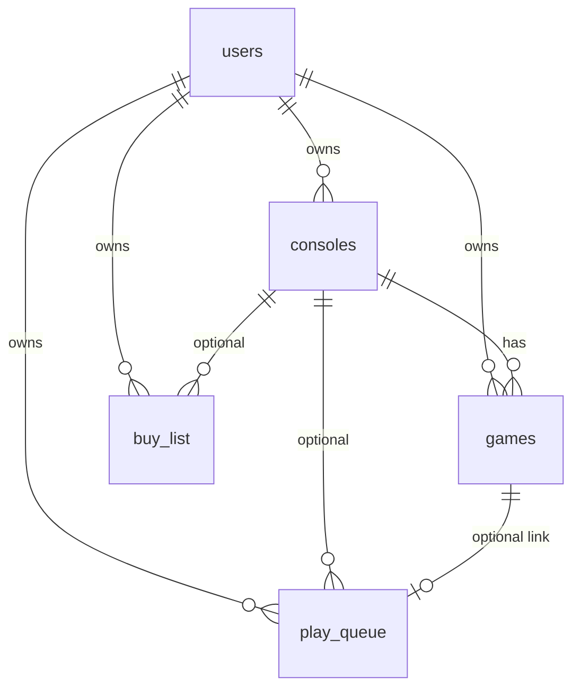
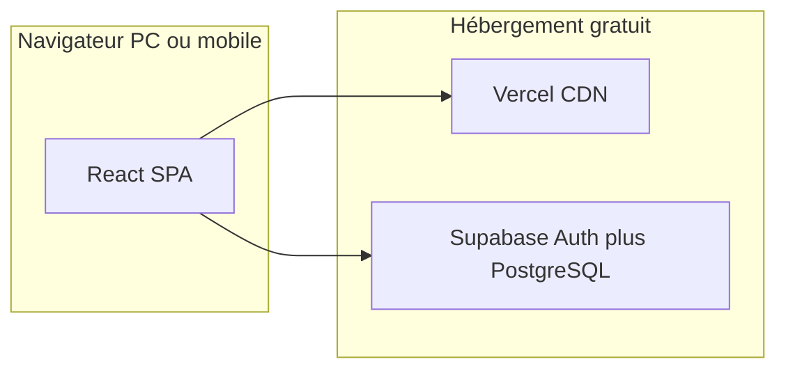

# Application de gestion de collection de jeux vidéo

## Contexte actuel

Le dépôt [`/home/julien/git/GameManagerV2`](/home/julien/git/GameManagerV2) ne contient que [`Games.xlsx`](/home/julien/git/GameManagerV2/Games.xlsx). Structure analysée :

| Feuille | Colonnes | Volume |
|---------|----------|--------|
| **Games** | Console, Titre, Demat, Progression | ~266 jeux, 19 consoles |
| **To Buy** | Titre, Console, demate, Prix | ~70 entrées |
| **Mathilde** | — | ignorée (une seule collection) |

Valeurs Excel à mapper :
- **Progression** : `TODO`, `IN_PROGRESS`, `DONE` → ajouter `ABANDONED` (abandonné)
- **Demat** : booléen (physique / dématérialisé)
- **Consoles** : liste fixe en colonne G (PS ONE, PS2, SWITCH, etc.)

La feuille **Games** ne contient pas encore de priorité pour la backlog : c’est une **nouvelle fonctionnalité** distincte de la progression `TODO`.



## Stack recommandée (gratuit, navigateur PC + mobile)

| Couche | Choix | Pourquoi |
|--------|-------|----------|
| Frontend | **React + Vite + TypeScript + Tailwind CSS** | SPA rapide, UI responsive, déploiement simple |
| UI | Composants type **shadcn/ui** (ou équivalent léger) | Formulaires, tables, filtres, bottom nav mobile |
| Backend / BDD | **Supabase** (PostgreSQL + Auth + API REST) | Gratuit, auth email/Google, RLS pour données privées |
| Hébergement | **Vercel** (frontend) + Supabase Cloud (BDD) | Tiers gratuits suffisants pour usage personnel |

Option **PWA** (manifest + icône) : installation sur l’écran d’accueil du téléphone sans store.

## Modèle de données (Supabase)

**`consoles`** — référentiel par utilisateur  
- `id`, `user_id`, `name` (ex. `SWITCH`, `PS5`)

**`games`** — collection possédée  
- `id`, `user_id`, `console_id`, `title`, `is_digital` (Demat), `progress` (`todo` | `in_progress` | `done` | `abandoned`), `created_at`, `updated_at`  
- Index unique : `(user_id, console_id, title)` pour éviter les doublons

**`play_queue`** — jeux à faire avec priorité  
- `id`, `user_id`, `title`, `console_id` (nullable si jeu pas encore en collection), `game_id` (nullable, lien vers `games` si déjà possédé), `priority` (entier, 1 = plus urgent), `notes` (optionnel)  
- Tri par `priority ASC`

**`buy_list`** — jeux à acheter  
- `id`, `user_id`, `title`, `console_id`, `is_digital`, `price` (numeric nullable), `notes`

**Sécurité** : Row Level Security (RLS) — chaque table filtrée par `auth.uid() = user_id`.

## Fonctionnalités par écran

1. **Connexion** — email/mot de passe + OAuth Google (Supabase Auth), français.
2. **Tableau de bord** — compteurs : total jeux, par progression, par console ; raccourcis vers listes.
3. **Collection** — liste filtrable/triable (console, progression, demat) ; CRUD jeu ; vue mobile en cartes, desktop en tableau.
4. **À jouer** — file priorisée : ajouter un jeu (depuis la collection ou saisie libre), réordonner (drag-and-drop ou boutons haut/bas), retirer.
5. **À acheter** — comme feuille To Buy : titre, console, demat, prix (€) ; total estimé optionnel.
6. **Consoles** — gestion du référentiel (pré-rempli à l’import).
7. **Import Excel** — page unique au premier usage (ou menu) : upload `Games.xlsx` → script client ou Edge Function qui parse les feuilles **Games** et **To Buy** et insère en base pour l’utilisateur connecté.

## Import depuis [`Games.xlsx`](/home/julien/git/GameManagerV2/Games.xlsx)

Script d’import (côté app, avec `xlsx` / `sheetjs`) :

- Feuille **Games** : lignes 2+ → `games` + création `consoles` si absentes ; mapping `TODO`→`todo`, `IN_PROGRESS`→`in_progress`, `DONE`→`done`.
- Feuille **To Buy** : lignes 2+ → `buy_list` ; prix `'?'` ou vide → `null`.
- Jeux `TODO` / `IN_PROGRESS` : proposition d’ajouter automatiquement à `play_queue` (priorité par défaut à la fin) — option cochée à l’import.
- Rapport post-import : X créés, Y ignorés (doublons).

Fichier Excel conservé dans le repo comme **référence de migration** ; l’app devient la source de vérité ensuite.

## Architecture applicative

```
src/
  components/     # GameCard, ConsoleFilter, PriorityList, ...
  pages/          # Dashboard, Collection, PlayQueue, BuyList, Import, Auth
  lib/
    supabase.ts   # client Supabase
    import-xlsx.ts
  types/          # Game, Console, Progress, ...
supabase/
  migrations/     # SQL schéma + RLS + seed consoles optionnel
```



## Déploiement (gratuit)

1. Créer projet **Supabase** (région EU si possible).
2. Appliquer migrations SQL (`supabase db push` ou SQL Editor).
3. Activer Auth (email + Google dans dashboard Supabase).
4. Repo GitHub → connecter **Vercel** ; variables d’environnement : `VITE_SUPABASE_URL`, `VITE_SUPABASE_ANON_KEY`.
5. Premier login → import Excel → vérifier les compteurs (~266 jeux, ~70 à acheter).

Limites tier gratuit : largement suffisant pour une collection personnelle ; surveillance si stockage fichiers (pas prévu sauf export CSV futur).

## UX mobile

- Navigation inférieure : Accueil | Collection | À jouer | À acheter | Profil
- Formulaires pleine largeur, zones tactiles ≥ 44px
- Filtres en drawer / sheet sur petit écran
- PWA pour accès hors onglet (cache shell uniquement ; données toujours via Supabase)

## Ordre d’implémentation proposé

1. Initialiser projet Vite + Tailwind + structure routes
2. Schéma Supabase + RLS + client auth
3. CRUD collection + consoles
4. Listes à jouer (priorité) et à acheter
5. Import Excel + mapping des valeurs existantes
6. Polish responsive + PWA + déploiement Vercel

## Hors scope (v1)

- Feuille Mathilde / multi-profils
- Sync bidirectionnelle Excel
- API jeux externes (IGDB, etc.)
- Partage public de collection
